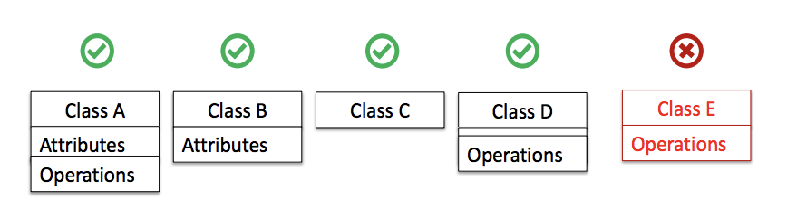
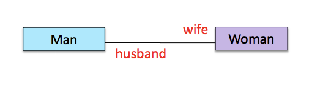
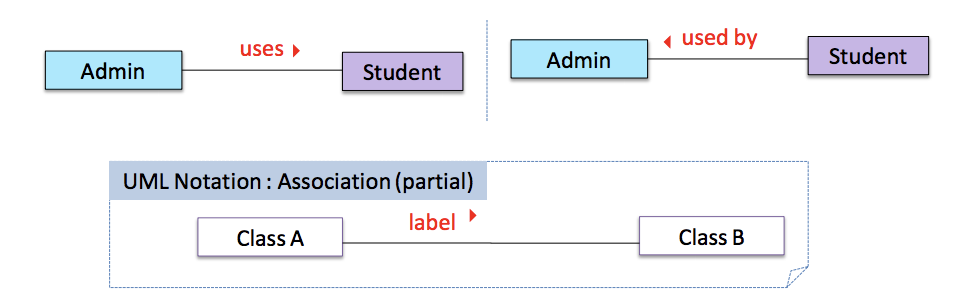
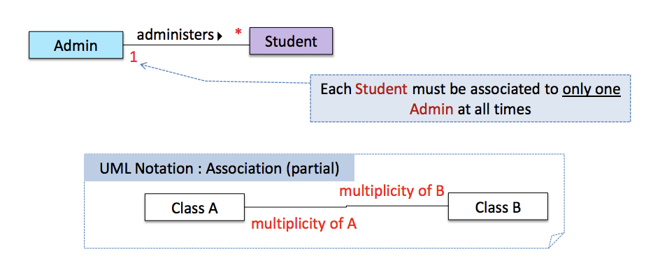
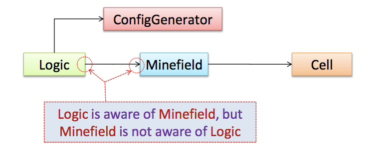

Scripted testing is to first write a set of test cases based on the specification, performing the test cases and reporting any failures to the developers.
Exploratory testing is the process of devising new test cases based on the result of past test cases. (Aliases: reactive testing, error guessing technique, attack-based testing, and bug hunting)

Exploratory testing depends on the tester's prior experience and intuition. It is not a secure way of testing.

Scripted testing is more systematic and are more likely to discover the bug.

Regression testing: Testing to prevent regressions in functionality.

SLAP: Single Level of Abstraction Per method

Refactoring: Improving the program's internal structure without modifying its external behaviour. Fixing bugs is not refractoring, and we must do regression testing after each change.

Revision control: The process of managing multiple versions of a code base.

Centralised Revision Control System (CRCS): a central remote repository shared by the team.

Distributed Revision Control System (DRCS): Every team member has his or her own remote repository in addition to their own local repository.

## UML Class Diagrams
UML class diagrams describe the structure but not the behaviour of an object.

### Visibility
The visibility of attributes and operations is used to indicate the level access a lot for each attribute or operation.

`+` public
`-` private
`#` protected
`~` package

### Associations
As objects work with one another, collaborations are used to represent connections or associations.
An association link denotes a *permanent* or *semipermanent* structural link between the objects.

### Dependencies
Temporary contact between objects are dependencies instead. These are denoted with a dashed line.

### Operations
The ‘Operations’ compartment (or even both ‘Attributes’ and ‘Operations’ compartments) may be omitted if such details are not important.

#### Roles
'Role' labels are optionally used to indicate the role played by the classes in the relationship.

'Association' labels are used to describe the association. The arrow indicates the direction to be read.

Multiplicity is the number of objects that participate in the association.
`0..1` optional, can 0 or 1 objects
`1` compulsory, must always be linked to one object
`*` can be linked to 0 or more objects
`n..m` must be n to m inclusive

#### Navigability
Navigability (denoted with an arrowhead in the association link) indicates whether a class is aware of the other class (i.e. holds a reference to the other class).

## Object diagrams
An object diagram shows an object structure at a given point of time while a class diagram represents the general situation. Object names are underlined. Class-level attributes and variables are also underlined.

# Principles of Class Design
## Single Responsibility Principle (SRP)
A class should have one, and only one, reason to change.
If a class has more than one responsibility, then the responsibilities become coupled. Changes to one responsibility may impair or inhibit the class’ ability to meet the others.
## Open Closed Principle (OCP)
Entities should be open for extension, but closed for modification (no touching at all).
You should be able to extend a classes behavior, without modifying it.
Therefore, one must have insight to design classes such that they can be easily extended.
E.g. Instead of calculating area for the Shape, AreaCalculator should take in Shape classes that implement the `area` function.
## Liskov Substitution Principle (LSP)
Derived classes must be substitutable for their base classes.

This goes together with Open Close Principle.

E.g. Instead of finding the type of shape and then calculating the area for that type, AreaCalculator should be agnositic of the subtypes of `Shape`.

## Interface Segregation Principle (ISP)
Make fine grained interfaces that are client specific.
## Dependency Inversion Principle (DIP)
Depend on abstractions, not on concretions.
# Encapsulation
It packages data and related functions together into one entity. The data is hidden from the outside world and are only assessible using functions.

## Testing your own code
Advantages:
- Can be done early (the earlier we find a bug, the cheaper it is to fix).
- Can be done at lower levels, for examples, at operation and class level (testers usually test the system at UI level).
- It is possible to do more thorough testing since developers know the expected external behavior as well as the internal structure of the component.
- It forces developers to take responsibility for their own work (they cannot claim that “testing is the job of the testers”).
Disadvantages:
- Developer may unconsciously test only situations that he knows to work (i.e. test it too
“gently”).
- Developer may be blind to his own mistakes (if he did not consider a certain
combination of input while writing code, he is likely to miss it again during testing).
- Developer may have misunderstood what the SUT is supposed to do in the first place.
- Developer may lack the testing expertise.

[]: https://www.dropbox.com/s/5cg6xmpzsf24so4/Screenshot%202016-11-24%2016.32.40.png?dl=0
