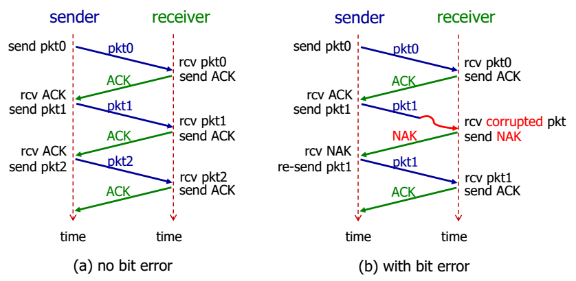
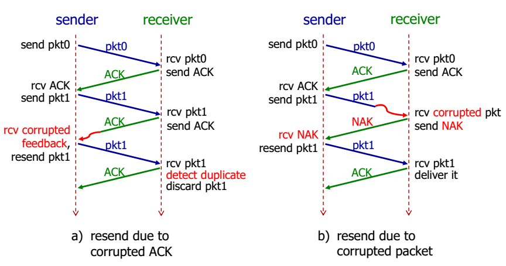
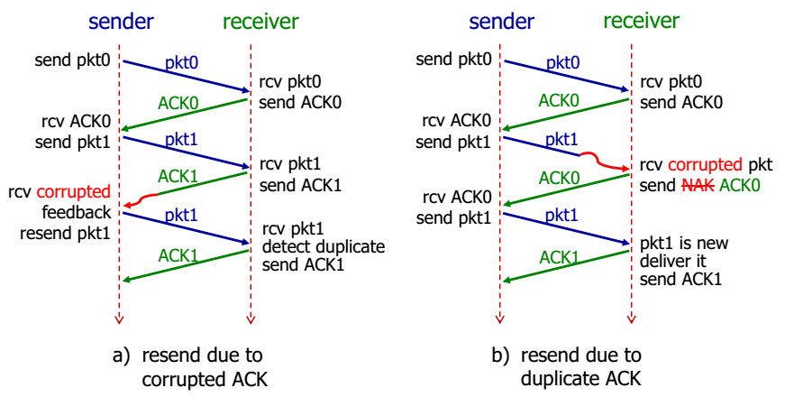
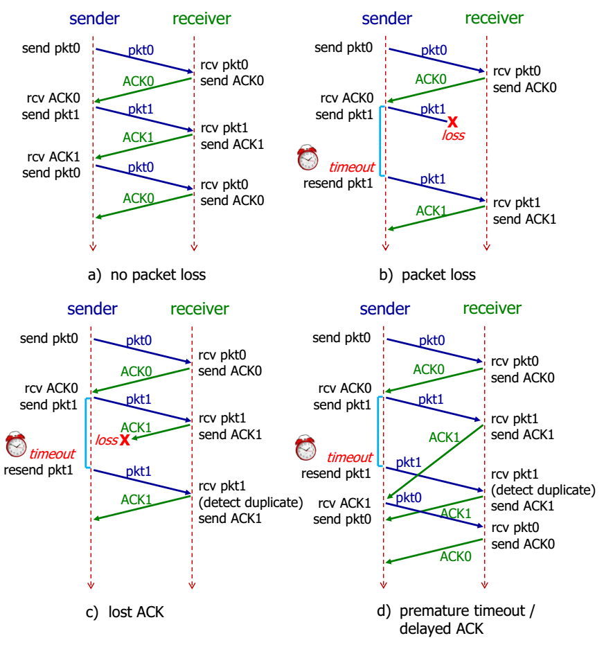
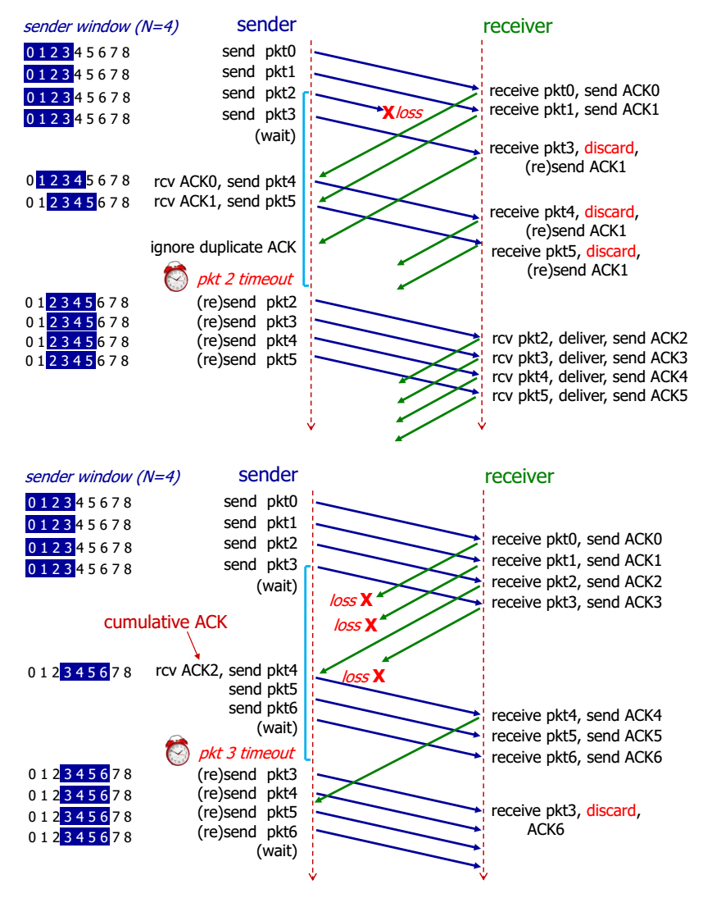
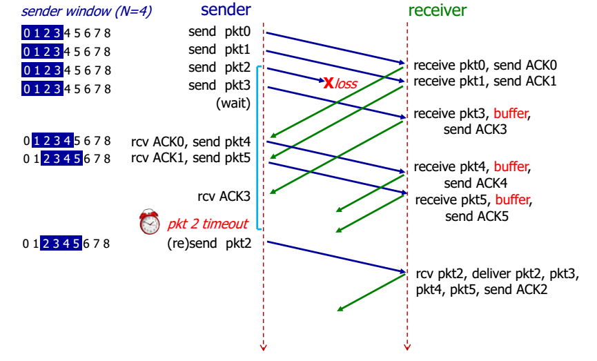

# Transport Layer Services

Transport / Network Layers
Each IP datagram contains source and dest IP addresses.
- Receiving host is identified by dest IP address.
- Each IP datagram carries one transport-layer segment.
- Each segment contains source and dest port numbers.

## User Datagram Protocol (UDP)
Pros:
* No connection establishment (which can add delay)
* Simple: no connection state at sender, receiver
* Small header size
* No congestion control: UDP can blast away as fast as desired

### Connectionless De-multiplexing
Sender | Receiver
-------|---------
Creates a socket with local port # |
When creating a datagram, sender must specify dest. IP address and port #. |
 | Checks destination port # in segment.
 | Directs UDP segment to the socket with that port #.
 | IP datagrams (from different sources) with the same destination port # will be directed to the same UDP socket at destination.

### UDP Header
32 bits
16 bits: source port #, dest port #, length, checksum

#### UDP checksum
1. Treat UDP segment as a sequence of 16-bit integers.
1. Apply binary addition on every 16-bit integer (checksum field is currently 0).
2. Carry (if any) from the most significant bit will be added to the result.
3. Compute 1’s complement to get UDP checksum.

```
  1 1 1 0  0 1 1 0  0 1 1 0  0 1 1 0  // x
  1 1 0 1  0 1 0 1  0 1 0 1  0 1 0 1  // + y
____________________________________
1 1 0 1 1  1 0 1 1  1 0 1 1  1 0 1 1 // wraparound carry
____________________________________
  1 0 1 1  1 0 1 1  1 0 1 1  1 1 0 0  // sum
____________________________________
  0 1 0 0  0 1 0 0  0 1 0 0  0 0 1 1  // checksum

```

### Transport vs. Network Layer
Transport layer resides on end hosts and provides process-to-process communication.

Network layer provides host-to-host, best-effort and unreliable communication.

As network layer is unreliable, transport layer for TDP has to account for unreliability through reliable data transfer
protocols (rdt).

### RDT 1.0
Sender sends data into underlying (perfect) channel
Receiver read data from underlying (perfect) channel

### RDT 2.0
Underlying channel may flip bits in packets,



Does not detect duplicate pkt, and method will fail, if ACK/NAK is corrupted.

### RDT 2.1
* Sender retransmits current packet if ACK/NAK is garbled.
* Sender adds sequence number to each packet.
* Receiver discards (doesn’t deliver up) duplicate packet.



Overhead of having packet number plus ACK/NAK, and still a wait and stop protocol.

### RDT 2.2
Instead of sending NAK, receiver sends ACK and packet num for the last packet received OK.



Still a wait and stop protocol.

### RDT 3.0
Now may lose packets and may incur arbitrarily long packet delay.

Sender retransmits if no ACK is received till timeout,


Performance is bad.

```
U = (L / R) / (RTT + L / R)

Where U is utilization of the channel
L / R is transmission rate
RTT is round trip time
```

### Pipelining
Increasing utilization by sending multiple packets within a window.

#### Go-back-N
Sends in batches of fixed size. Continually move this window of batches if the smallest N has been received, else, kept sending same window.



#### Selective Repeat
Receiver individually acknowledges all correctly received packets. Sender maintains timer for each unACKed packet.



# Glossary of Terms

Term | Meaning
---------|---------
**Byte** | 8 bits
**Packet** | data of some bits
**Transmission rate** | rate of bits/sec
**End-to-end delay** | `2 * bits/transmission rate` (assuming no other delay)
**Packet delay** | time to check bit errors and determine output link
**Queuing delay** | time waiting in the buffer queue for transmission.
**Transmission delay** | number of **bits** / transmission rate (bits/sec)
**Propagation delay** | length of the link / propagation speed in medium.
**RTT** | time for a packet to travel from client to server and go back
**Stream socket** | TCP Socket
**Datagram socket** | UDP Socket
**ACK** | Acknowledgements
**NAK** | Negative acknowledgements
**Sequence number** | Seq num of previous packet received successfully


Term | Meaning
---------|---------
**HTTP** | **H**yper**t**ext **t**ransfer **p**rotocol
**RR** | resource records as used in DNS servers
**Root Servers** | Root DNS servers
**Sockets** | software interface between app processes and transport layer protocols