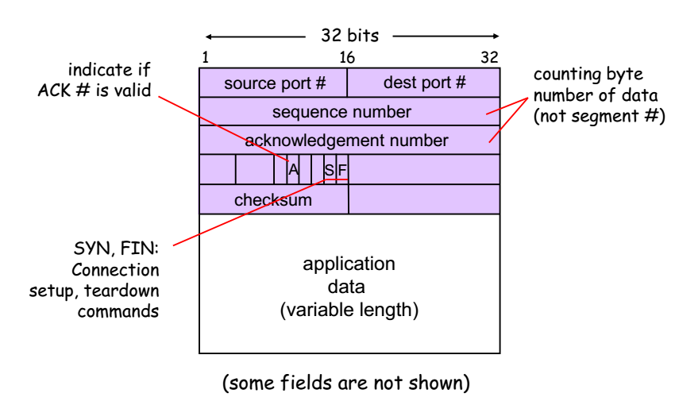
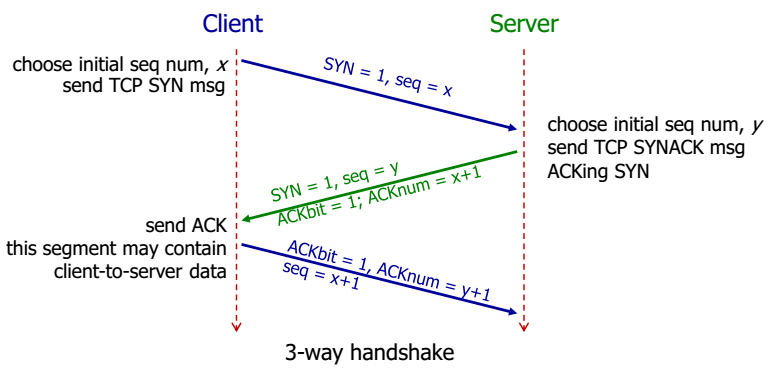
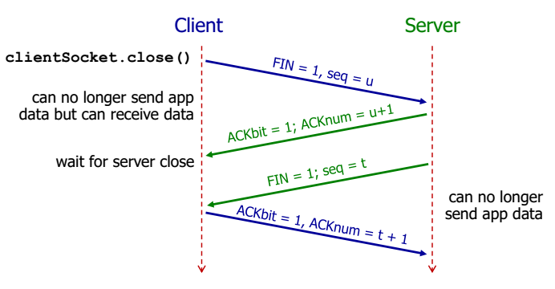

# Transport Control Protocol (TCP)
A TCP connection (socket) is identified by 4-tuple:
* (srcIPAddr, srcPort, destIPAddr, destPort)
* Receiver uses all four values to direct a segment to the appropriate socket.

### TCP Header


#### TCP Sequence Number
"byte number" of the first byte of data in a segment

Example:
Send a file of 500,000 bytes; MSS is 1000 bytes.
Each IP datagram contains source and dest IP addresses.

Seq. # of 1st TCP segment: 0, 2nd TCP segment: 1000, 3rd TCP segment: 2000, 4th TCP segment: 3000, etc

#### TCP ACK Number
Seq # of the next byte of data expected by receiver. TCP ACKs up to the first missing byte in the stream (cumulative ACK).

#### TCP Timeout Value
Too short of a timeout causes premature timeout and unnecessary retransmissions. Too long timeout however results in slow reaction to segment loss.

```
EstimatedRTT = (1- α)*EstimatedRTT + α*SampleRTT
(typical value of α : 0.125)
DevRTT = (1-β)*DevRTT + β*|SampleRTT-EstimatedRTT|
(typical value of β : 0.25)
TimeoutInterval = EstimatedRTT + 4*DevRTT
```

#### TCP Fast Retransmission
If sender receives **3** duplicate ACKs for the same data, it supposes that segment after ACKed data is lost. Sender will then resend segment before timer expires.

### TCP Handshake


Also known as 3-way handshake.

Client, server each close their side of connection by sending TCP segment with FIN bit = 1.


# Glossary of Terms

Term | Meaning
---------|---------
**Byte** | 8 bits
**Packet** | data of some bits
**Transmission rate** | rate of bits/sec
**End-to-end delay** | `2 * bits/transmission rate` (assuming no other delay)
**Packet delay** | time to check bit errors and determine output link
**Queuing delay** | time waiting in the buffer queue for transmission.
**Transmission delay** | number of **bits** / transmission rate (bits/sec)
**Propagation delay** | length of the link / propagation speed in medium.
**RTT** | time for a packet to travel from client to server and go back
**Stream socket** | TCP Socket
**Datagram socket** | UDP Socket
**ACK** | Acknowledgements
**NAK** | Negative acknowledgements
**Sequence number** | Seq num of previous packet received successfully
**TCP Sequence Number** | "byte number" of the first byte of data in a segment

Term | Meaning
---------|---------
**HTTP** | **H**yper**t**ext **t**ransfer **p**rotocol
**RR** | resource records as used in DNS servers
**Root Servers** | Root DNS servers
**Sockets** | software interface between app processes and transport layer protocols