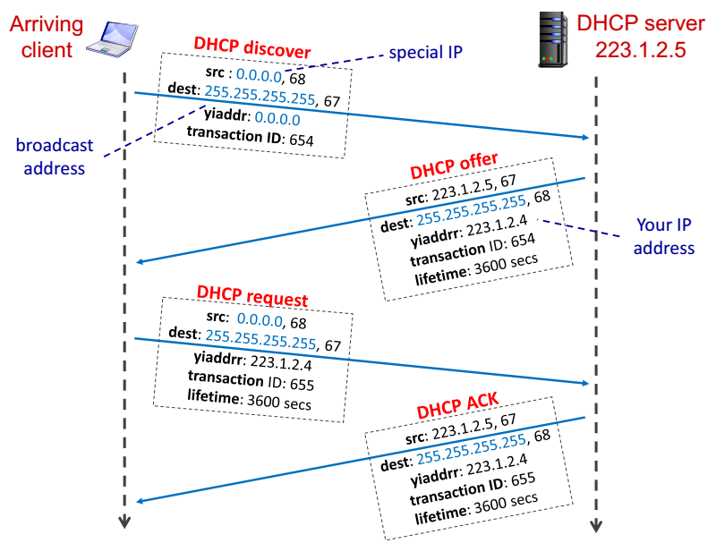

# IP Address
IP address is used to identify a host (or a router). 32-bit integer which can be manually configured or automatically assigned by a DHCP (Dynamic Host Configuration Protocol) server.

## DHCP
DHCP allows a host to dynamically obtain its IP address from DHCP server when it joins network.

1) Host broadcasts “DHCP discover” message
2) DHCP server responds with “DHCP offer” message
3) Host requests IP address: “DHCP request” message
4) DHCP server sends address: “DHCP ACK” message



DHCP runs over UDP, where port 67/68 are reserved for server and client respectively.

#### Special IP
* 0.0.0.0/8
* 127.0.0.0/8
* 10.0.0.0/8
* 172.16.0.0/12
* 192.168.0.0/16
* 255.255.255.255/32

## IP Address and Subnet
IP address comprises of network prefix and host ID, totaling 32 bits.

### Subnet
Subnet is a network formed by a group of “directly” interconnected hosts.

The hosts have the same network prefix and they can reach each other without a router. However, in order to access the internet, a router is required.

#### Assignment strategy
Assignment strategy is known as Classless Inter-domain Routing (CIDR).

`a.b.c.d/x`, where `x` is the number of bits in subnet prefix of IP address.

##### Subnet Mask
Subnet mask is used to determine what subnet an IP address belongs to, by setting all subnet prefix bits to "1"s and host ID bits to "0"s.
```
<-----subnet prefix-----><-host ID->
11001000 00010111 00010000 00101010 // IP address
11111111 11111111 11111110 00000000 // Subnet mask
```

##### Matching
Packet gets delivered to the router with the longest matching prefix.

# Glossary of Terms

Term | Meaning
---------|---------
**Byte** | 8 bits
**Packet** | data of some bits
**Transmission rate** | rate of bits/sec
**End-to-end delay** | `2 * bits/transmission rate` (assuming no other delay)
**Packet delay** | time to check bit errors and determine output link
**Queuing delay** | time waiting in the buffer queue for transmission.
**Transmission delay** | number of **bits** / transmission rate (bits/sec)
**Propagation delay** | length of the link / propagation speed in medium.
**RTT** | time for a packet to travel from client to server and go back
**Stream socket** | TCP Socket
**Datagram socket** | UDP Socket
**ACK** | Acknowledgements
**NAK** | Negative acknowledgements
**Sequence number** | Seq num of previous packet received successfully
**TCP Sequence Number** | "byte number" of the first byte of data in a segment
**DHCP** | Server that assigns IP addresses
**CIDR** | Classless Inter-domain Routing, assignment strategy for IP addresses.


Term | Meaning
---------|---------
**HTTP** | **H**yper**t**ext **t**ransfer **p**rotocol
**RR** | resource records as used in DNS servers
**Root Servers** | Root DNS servers
**Sockets** | software interface between app processes and transport layer protocols