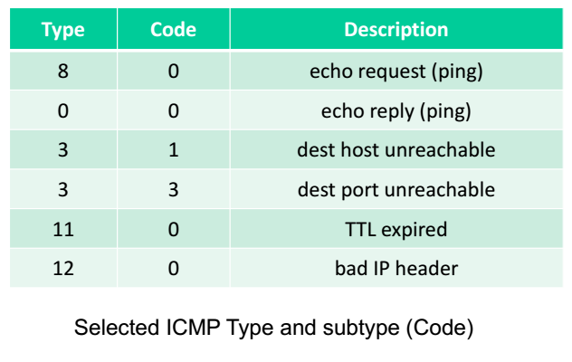

# Routing
The internet is a hierarchy of Autonomous Systems (AS), e.g., ISPs, each with their own routers and links.

## Intra-AS routing
Finding a good path between local routers in an AS. Commonly used protocols: RIP, OSPF.

Single admin, so no policy decisions is needed.
Routing mostly focus on performance.

### RIP (Routing Information Protocol)
Implements the Distance Vector algorithm. It uses hop count as the cost metric and therefore insensitive to network congestion.
* Entries in the routing table are aggregated subnet masks (so we are routing to destination subnet).
* Exchange routing table every 30 seconds over
UDP port 520.
* “Self-repair”: if no update from a neighbour router for 3 minutes, assume neighbour has failed.

## Network Address Translation (NAT)
Internal IP addresses can mapped to different ports in the router.

NAT routers must:
* Replace (source IP address, port #) of every outgoing datagram to (NAT IP address, new port #).
* Remember (in NAT translation table) the mapping from (source IP address, port #) to (NAT IP address, new port #).
* Replace (NAT IP address, new port #) in destination fields of every incoming datagram with corresponding (source IP address, port #) stored in NAT translation table.

## IP Fragmentation
Different links may have different MTU (Max Transfer Unit) – the maximum amount of data a link-level frame can carry.

Destination host will reassemble the packet.
IP header fields are used to identify fragments
and their relative order.

Flag is set to
- `1` if there is next fragment from the same segment.
- `0` if this is the last fragment.

Offset is in expressed in unit of 8-bytes (e.g. 480 bits' offset will be 480/8 = 60)

### ICMP
ICMP (Internet Control Message Protocol) is used
by hosts & routers to communicate network-level
information, like error messages.

The messages are carried in IP datagrams.

### Ping and Traceroute
`ping` checks for a remote host's connection.

`traceroute` sends a few packets to trace the route the packets take.

# Glossary of Terms

Term | Meaning
---------|---------
**Byte** | 8 bits
**Packet** | data of some bits
**Transmission rate** | rate of bits/sec
**End-to-end delay** | `2 * bits/transmission rate` (assuming no other delay)
**Packet delay** | time to check bit errors and determine output link
**Queuing delay** | time waiting in the buffer queue for transmission.
**Transmission delay** | number of **bits** / transmission rate (bits/sec)
**Propagation delay** | length of the link / propagation speed in medium.
**RTT** | time for a packet to travel from client to server and go back
**Stream socket** | TCP Socket
**Datagram socket** | UDP Socket
**ACK** | Acknowledgements
**NAK** | Negative acknowledgements
**Sequence number** | Seq num of previous packet received successfully
**TCP Sequence Number** | "byte number" of the first byte of data in a segment
**DHCP** | Server that assigns IP addresses
**CIDR** | Classless Inter-domain Routing, assignment strategy for IP addresses.
**AS** | Autonomous Systems, network-of-networks of routers and links
**NAT** | Translates internal IP addresses to outside world.
**MTU** | Max Transfer Unit of a link-level frame

Term | Meaning
---------|---------
**HTTP** | **H**yper**t**ext **t**ransfer **p**rotocol
**RR** | resource records as used in DNS servers
**Root Servers** | Root DNS servers
**Sockets** | software interface between app processes and transport layer protocols